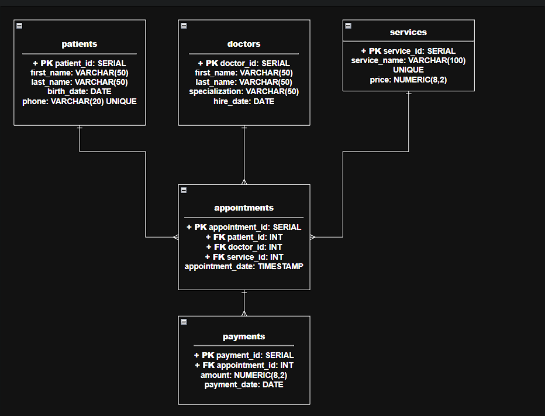
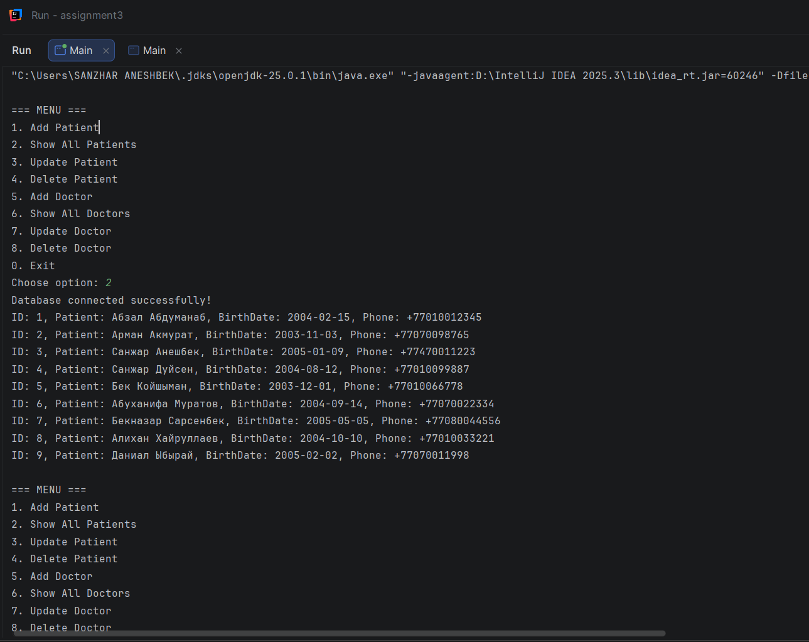
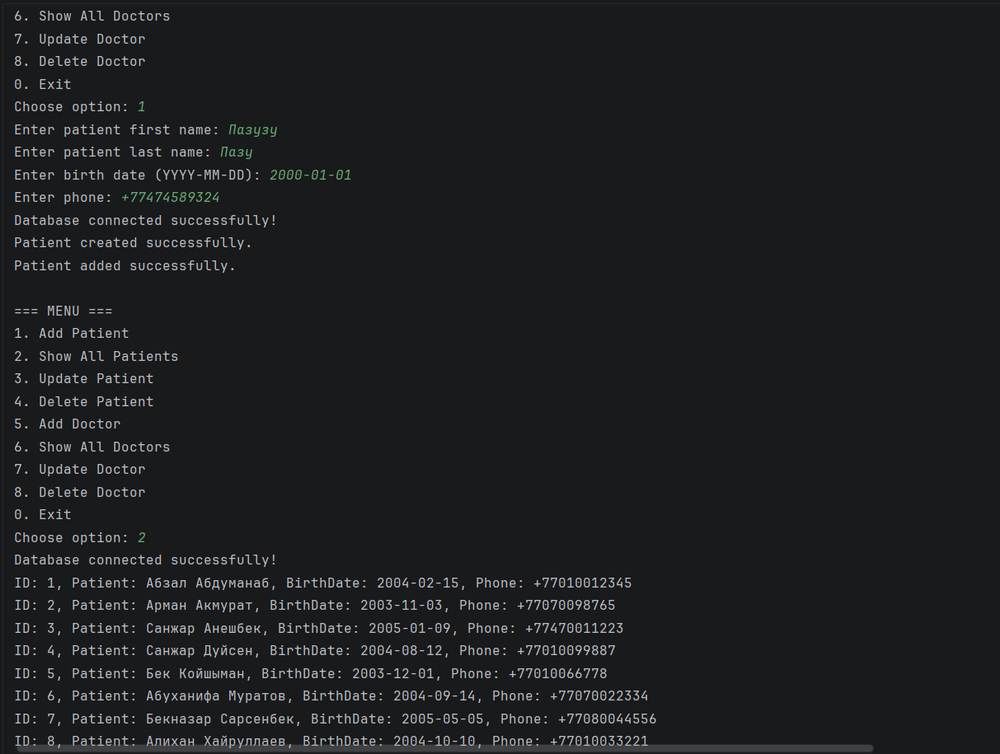
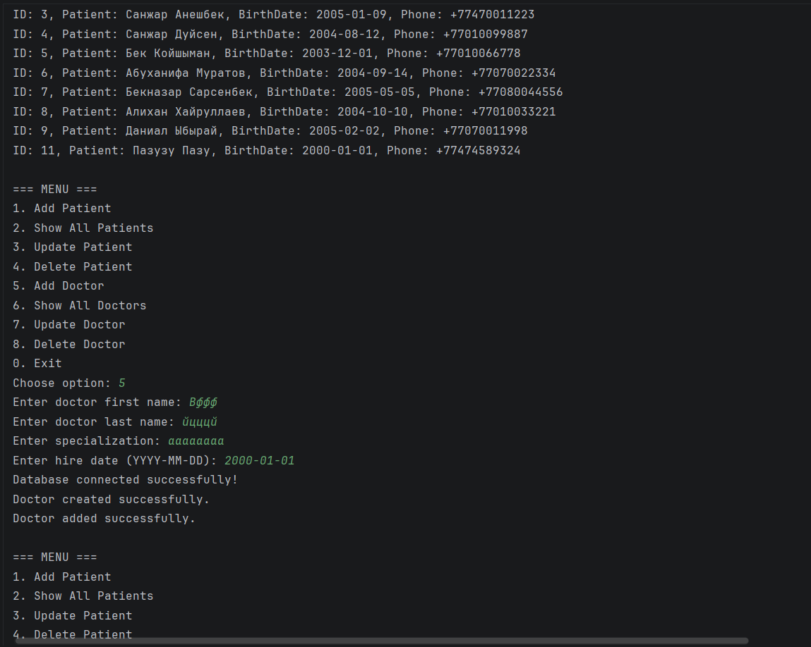
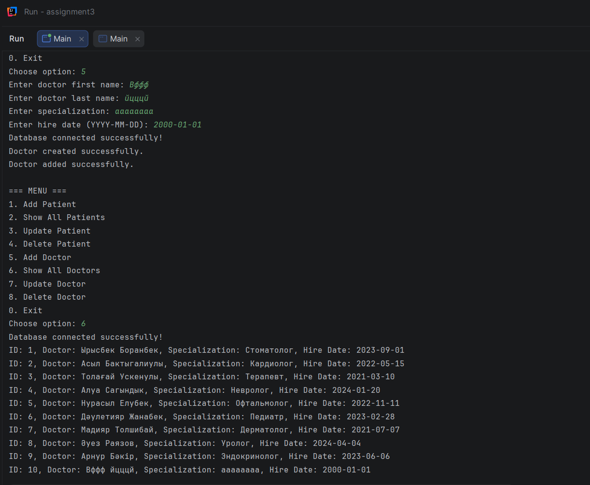
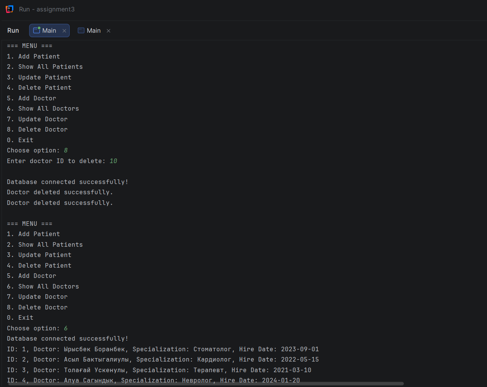
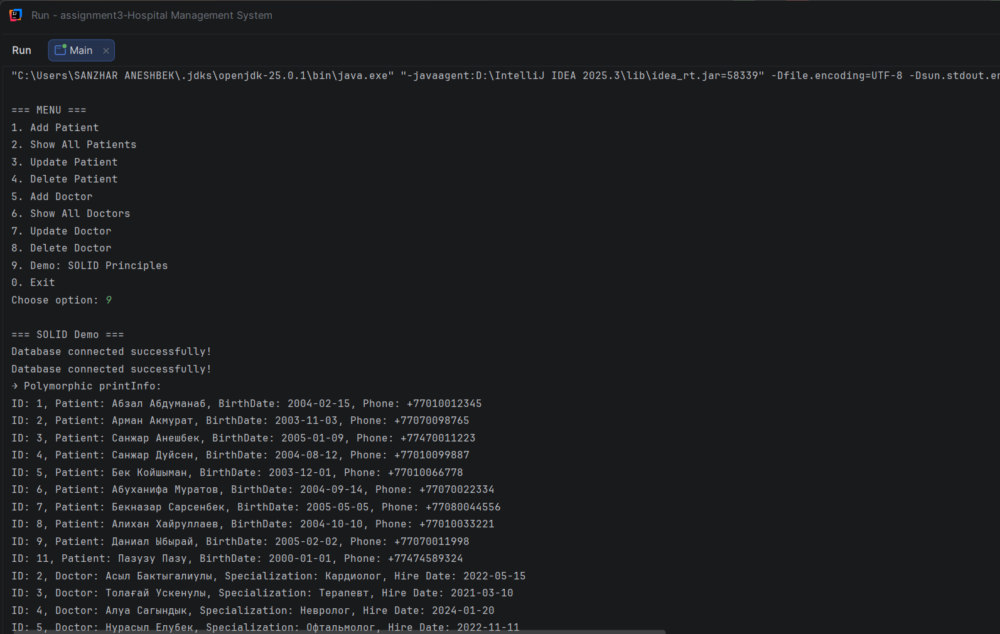
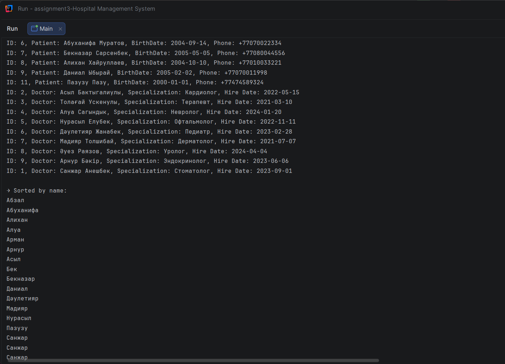

# Assignment 3 – Hospital Management System

## A. Project Overview
**Purpose of API:**  
This project implements a Hospital Management System API in Java with PostgreSQL. It provides CRUD operations for patients, doctors, services, appointments, and payments. The API ensures data validation, error handling, and multi-layer architecture (Controller → Service → Repository → Database).

**Summary of entities and their relationships:**
- **Patient**: has personal data and phone (unique).
- **Doctor**: has specialization and hire date.
- **Service**: medical service with description and price.
- **Appointment**: links Patient, Doctor, and Service with a scheduled date.
- **Payment**: linked to Appointment, stores amount and status.

Relationships:
- One Patient → many Appointments
- One Doctor → many Appointments
- One Service → many Appointments
- One Appointment → one Payment

**OOP design overview:**
- Abstract class `BaseEntity` defines common fields and abstract methods.
- Subclasses (`Patient`, `Doctor`, `Appointment`, `Service`, `Payment`) extend `BaseEntity`.
- Interfaces `Validatable` and `Payable` enforce validation and payment logic.
- Composition: `Appointment` contains `Patient`, `Doctor`, `Service`; `Payment` contains `Appointment`.
- Polymorphism: `printInfo()` overridden in all entities.

---

## B. OOP Design Documentation
**Abstract class and subclasses:**
- `BaseEntity` (id, name, timestamps, abstract methods `printInfo()`, `validate()`)
- Subclasses: `Patient`, `Doctor`, `Appointment`, `Service`, `Payment`

**Interfaces and implemented methods:**
- `Validatable`: `isValid()` implemented in all entities
- `Payable`: `pay(double amount)` implemented in `Payment`

**Composition/Aggregation:**
- `Appointment` aggregates `Patient`, `Doctor`, `Service`
- `Payment` aggregates `Appointment`

**Polymorphism examples:**
- `printInfo()` overridden in each entity to display specific details.
- Example: `Doctor.printInfo()` vs `Patient.printInfo()` produce different outputs.

**UML diagram (simplified):**


---

## C. Database Description
**Schema:**
- `patients(patient_id PK, first_name, last_name, birth_date, phone UNIQUE)`
- `doctors(doctor_id PK, first_name, last_name, specialization, hire_date)`
- `services(service_id PK, service_name UNIQUE, price CHECK > 0)`
- `appointments(appointment_id PK, patient_id FK, doctor_id FK, service_id FK, appointment_date)`
- `payments(payment_id PK, appointment_id FK, amount CHECK >= 0, payment_date)`

**Constraints & Foreign Keys:**
- FK links between appointments → patients, doctors, services
- FK link between payments → appointments
- Unique constraint on patient phone
- Check constraints on service price and payment amount

**Sample SQL inserts:**  
See [`schema.sql`](./schema.sql) for full inserts (9 patients, 9 doctors, 6 services, 6 appointments, 6 payments).

---

## D. Controller
**CRUD operations summary (examples):**
- **Create Patient:**  
  `addPatient(new Patient(...))` → inserts into DB
- **Read All Doctors:**  
  `getAllDoctors()` → returns list of doctors
- **Read by ID:**  
  `getPatientById(3)` → returns patient or throws `ResourceNotFoundException`
- **Update:**  
  `updateDoctor(2, doctor)` → updates doctor info
- **Delete:**  
  `deletePatient(5)` → removes patient by ID

Responses:
- Success → confirmation message
- Error → custom exception (`InvalidInputException`, `ResourceNotFoundException`, `DatabaseOperationException`)

---

## E. Instructions to Compile and Run
**Compile:**
```bash
javac -d out $(find . -name "*.java")
```
## F. Screenshots








---

## G. Reflection Section
**What I learned:**  
- How to design a system using OOP principles (inheritance, interfaces, polymorphism, composition).  
- How to connect a Java application to PostgreSQL using JDBC and implement CRUD operations.  
- How to structure a multi-layer architecture (Controller → Service → Repository → Database) for clear separation of concerns.  

**Challenges faced:**  
- Debugging SQL schema and foreign key relationships.  
- Handling exceptions consistently across different layers.  
- Configuring JDBC connection and working with `PreparedStatement`.  

# Assignment 4 – Hospital Management System (OOP + SOLID + Exceptions)

## A. Project Overview
**Purpose of API:**  
This project extends the Hospital Management System from Assignment 3 by applying advanced OOP principles, SOLID design, exception handling, generics, interfaces, reflection, and utility classes.  
It demonstrates how to build a robust, maintainable, and defense-ready architecture in Java with PostgreSQL.

**Key Features:**
- Abstract class hierarchy with polymorphism.
- Interfaces with default and static methods (ISP).
- Custom exception hierarchy for validation and database errors.
- Repository layer with generics and JDBC.
- Service layer with business logic, lambdas, and exception handling.
- Utility layer with reflection and sorting.
- Multi-layer architecture (Controller → Service → Repository → Database).

---

## B. OOP Design Documentation
**Abstract class and subclasses:**
- `BaseEntity` (id, name, timestamps, abstract methods `printInfo()`, `validate()`).
- Subclasses: `Patient`, `Doctor`, `Appointment`, `Service`, `Payment`.

**Interfaces and implemented methods:**
- `Validatable`: `isValid()`, plus `default printValidationStatus()` and `static notNull(Object obj)`.
- `Payable`: `pay(double amount)`, plus `default printReceipt()` and `static validateAmount()`.

**Composition/Aggregation:**
- `Appointment` aggregates `Patient`, `Doctor`, `Service`.
- `Payment` aggregates `Appointment`.

**Polymorphism examples:**
- `printInfo()` overridden in each entity to display specific details.
- Example: `Doctor.printInfo()` vs `Patient.printInfo()` produce different outputs.

---

## C. Exception Handling
**Custom exceptions:**
- `InvalidInputException` → thrown when validation fails.
- `DuplicateResourceException` → thrown when duplicate entity detected.
- `ResourceNotFoundException` → thrown when entity not found.
- `DatabaseOperationException` → wraps SQL errors in repository layer.

**Usage:**
- Models validate input and throw `InvalidInputException`.
- Services catch validation errors and check duplicates.
- Repositories wrap SQL exceptions into `DatabaseOperationException`.

---

## D. Repository Layer
**Generic CRUD interface:**  
`CrudRepository<T>` with methods `create`, `getAll`, `getById`, `update`, `delete`.

**Implementations:**
- `PatientRepository` → works with `patients` table.
- `DoctorRepository` → works with `doctors` table.
- `AppointmentRepository` → works with `appointments` table.

**Features:**
- Uses JDBC with `PreparedStatement` and `try-with-resources`.
- Wraps SQL errors in `DatabaseOperationException`.
- Returns full entity objects (`Patient`, `Doctor`, `Appointment`).

---

## E. Service Layer
**Examples:**
- `PatientService` → validates patients, checks duplicates, throws exceptions.
- `DoctorService` → validates doctors, checks duplicates, throws exceptions.

**Features:**
- Business logic separated from repository.
- Uses lambdas (`stream().anyMatch(...)`) for duplicate checks.
- Handles exceptions (`InvalidInputException`, `ResourceNotFoundException`, `DuplicateResourceException`).

---

## F. Utility Layer
- `DatabaseConnection` → manages PostgreSQL connection.
- `ReflectionUtils` → prints class info (fields, methods) using Reflection API.
- `SortingUtils` → generic sorting with `Comparator` and lambdas.

---

## G. Controller & Main Demonstration
`Main.java` demonstrates:
- Creating and validating entities.
- CRUD operations via services.
- Exception handling at controller level.
- Sorting entities with `SortingUtils` and lambdas.
- Reflection with `ReflectionUtils.printClassInfo()`.

---

## H. Instructions to Compile and Run
**Compile:**
```bash
javac -d out $(find . -name "*.java")
```
## I. Screenshots



## J. Reflection Section
**What I learned:**
- How to apply SOLID principles in practice.
- How to design and use interfaces with default and static methods.
- How to implement custom exception hierarchy for validation and database errors.
- How to use generics in repository and utility layers.
- How to apply Reflection API to inspect classes dynamically.
- How to use lambdas and streams for duplicate checks and sorting.

**Challenges faced:**
- Ensuring exception hierarchy was applied consistently across layers.
- Debugging JDBC queries and foreign key constraints.
- Demonstrating reflection and sorting in a meaningful way for defense.